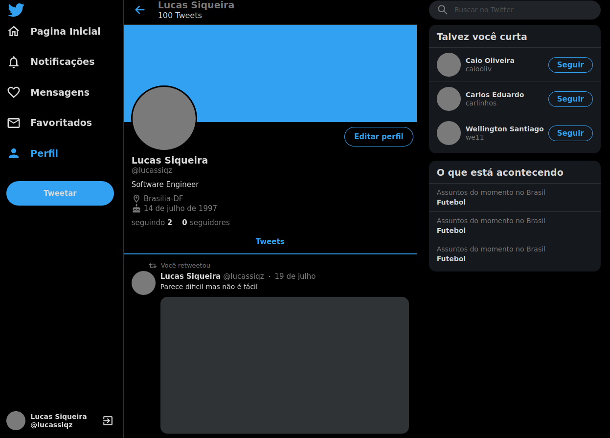
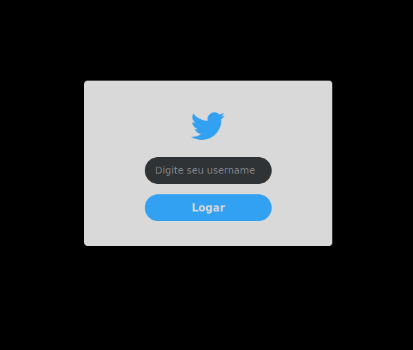
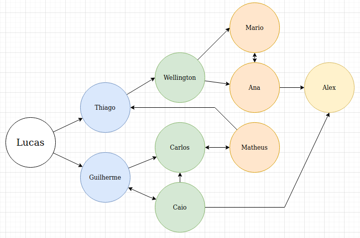

# TWTR (Em construção)

**Número da Lista**: 1 
**Conteúdo da Disciplina**: Grafos 1 

## Alunos
|Matrícula | Aluno |
| -- | -- |
| 16/0123119  |  Guilherme de Oliveira Aguiar |
| 15/0137567  |  Lucas Siqueira Rodrigues |

## Sobre 
Descreva os objetivos do seu projeto e como ele funciona. 
O projeto é um clone do twitter onde implementamos um algoritmo de recomendação de pessoas para seguir. O algoritmo é feito a partir de uma busca em largura. O projeto já começa com um usuário logado, sendo possível fazer login com outros usuários pré-cadastrados e também é possível seguir pessoas da área de recomendação, chamada "Talvez você curta". O sistema vai não vai te recomendar pessoas que você já segue, ele vai analisar as camadas intermediárias a partir do grafo que é criado tendo o usuário logado no momento como node inicial. Sempre que uma nova pessoa é seguida o BFS é chamado novamente e a lista de recomendações é atualizada.

## Screenshots

Perfil do usuário, com seção de recomendações no topo direito.
 

Popup de login.
 

Representação do grafo de usuários.

## Instalação 
**Linguagem**: TypeScript 
**Framework**: ReactJS 
Não é necessário instalar nada, o deploy da aplicação foi feito pelo netlify na url: https://grafos1-twtr.netlify.app/

## Uso 
Acessando o site pela URL, você pode trocar de usuário (a lista de usuários disponíveis esta logo abaixo), clicando na seta ao lado do nome do usuário logado no canto inferior esquerdo e também pode seguir usuários na sua lista de recomendações, o que gera uma nova lista.

#### Usuários disponíveis:
- lucassiqz
- guilherme-aguiar
- caiooliv
- carlinhos
- matheus-rn
- thiagoo
- we11
- an@_maria
- mario
- alex

